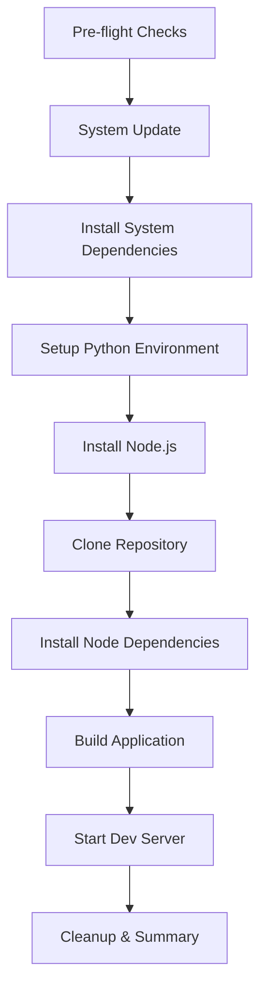

# Carbon GenAI Demo Deployment Script - Implementation Plan

## Overview
Create a fully automated bash script for RHEL/PPC64LE that deploys the Carbon GenAI Demo application with user-friendly console output and detailed logging.

## Requirements
- **Target Platform**: RHEL on PPC64LE architecture
- **Execution Mode**: Fully automated (no user intervention)
- **Output**: Clean console messages with detailed log file
- **Dev Server**: Start in background and exit script

## Script Architecture

### 1. Logical Step Groupings

The deployment steps are organized into these phases:



#### Phase 1: Pre-flight Checks
- Verify RHEL operating system
- Verify PPC64LE architecture
- Check sudo/root access
- Verify internet connectivity
- Check available disk space

#### Phase 2: System Update
- Run `sudo dnf -y update`

#### Phase 3: Install System Dependencies
- Install Python 3.12 and development tools
- Install Git, GCC, G++
- Install Node.js

#### Phase 4: Setup Python Environment
- Create Python virtual environment
- Activate virtual environment
- Upgrade pip

#### Phase 5: Clone Repository
- Clone Carbon-GenAI-Demos from GitHub
- Verify clone success

#### Phase 6: Install Node Dependencies
- Install Yarn globally
- Navigate to carbon-ui directory
- Install project dependencies
- Add specific Carbon packages
- Install additional npm packages

#### Phase 7: Build Application
- Run `yarn build`

#### Phase 8: Start Dev Server
- Start `yarn dev` in background
- Save PID for management
- Verify server started successfully

#### Phase 9: Cleanup & Summary
- Display deployment summary
- Show log file location
- Show dev server access information
- Provide stop command

### 2. Logging Framework Design

**Two-tier output system:**

#### Console Output (stdout)
- Clean, high-level progress messages
- Emoji/symbols for visual clarity
- Step numbers and descriptions
- Success/failure indicators
- Estimated time remaining
- Final summary with key information

Example:
```
[1/7] 🔍 Running pre-flight checks...
[2/7] 📦 Updating system packages...
[3/7] 🐍 Setting up Python environment...
...
✅ Deployment completed successfully!
```

#### Log File (detailed)
- Timestamp for each operation
- Full command output (stdout/stderr)
- Error details and stack traces
- Environment variables
- System information
- Performance metrics (duration per step)

**Log file location**: `./carbon-deployment-YYYYMMDD-HHMMSS.log`

### 3. Script Structure

```bash
#!/bin/bash

# Script: deploy-carbon-genai.sh
# Purpose: Automated deployment of Carbon GenAI Demo on RHEL/PPC64LE

# Global variables
SCRIPT_DIR="$(cd "$(dirname "${BASH_SOURCE[0]}")" && pwd)"
LOG_FILE="carbon-deployment-$(date +%Y%m%d-%H%M%S).log"
VENV_NAME="carbon.venv"
REPO_URL="https://github.com/EMEA-AI-SQUAD/Carbon-GenAI-Demos"
REPO_DIR="Carbon-GenAI-Demos"
APP_DIR="carbon-ui"

# Color codes for output
RED='\033[0;31m'
GREEN='\033[0;32m'
YELLOW='\033[1;33m'
BLUE='\033[0;34m'
NC='\033[0m' # No Color

# Functions:
# - log_message()      : Write to log file with timestamp
# - print_step()       : Display step progress to console
# - run_command()      : Execute command with logging
# - check_success()    : Verify command success
# - preflight_checks() : Validate environment
# - cleanup_on_error() : Rollback on failure
# - main()            : Orchestrate deployment
```

### 4. Error Handling Strategy

**For each step:**
1. Execute command with output redirection to log
2. Check exit code
3. On failure:
   - Log detailed error
   - Display user-friendly error message
   - Attempt cleanup if possible
   - Exit with non-zero code

**Rollback capabilities:**
- Track installed packages
- Save original state
- Provide cleanup script on failure

### 5. Key Features

#### Progress Indicators
- Step counter (e.g., [3/7])
- Emoji/symbols for visual feedback
- Elapsed time per step
- Overall progress percentage

#### Validation Checks
- Verify each installation succeeded
- Check service availability
- Validate file/directory creation
- Test network connectivity when needed

#### Background Process Management
- Start dev server with `nohup`
- Redirect output to log file
- Save PID to file for later management
- Verify server is listening on expected port

#### Summary Report
```
✅ Deployment Summary
━━━━━━━━━━━━━━━━━━━━━━━━━━━━━━━━━━━━━━━━━
📁 Installation Directory: /path/to/Carbon-GenAI-Demos
🌐 Dev Server: http://localhost:3000
📋 Log File: carbon-deployment-20260303-162800.log
⏱️  Total Time: 8m 32s

🛑 To stop the dev server:
   kill $(cat carbon-dev-server.pid)

📖 For more information, see README.md
```

### 6. Additional Files to Create

#### README.md
- Script usage instructions
- Prerequisites
- Troubleshooting guide
- Manual deployment steps (fallback)

#### stop-server.sh
- Helper script to stop the dev server
- Reads PID from file
- Graceful shutdown

#### check-status.sh
- Verify deployment status
- Check if services are running
- Display current state

## Implementation Order

1. Create main deployment script skeleton
2. Implement logging functions
3. Add pre-flight checks
4. Implement each deployment phase
5. Add error handling and rollback
6. Implement background process management
7. Create helper scripts
8. Write documentation
9. Test on RHEL/PPC64LE system

## Testing Checklist

- [ ] Fresh RHEL/PPC64LE system
- [ ] System with partial installation
- [ ] Network failure scenarios
- [ ] Insufficient disk space
- [ ] Missing sudo privileges
- [ ] Repository clone failures
- [ ] Package installation failures
- [ ] Dev server startup issues

## Success Criteria

✅ Script runs without user intervention
✅ Clear console output (not overwhelming)
✅ Detailed log file for debugging
✅ Proper error handling and reporting
✅ Dev server starts in background
✅ Clean exit with summary
✅ Helper scripts for management
✅ Comprehensive documentation